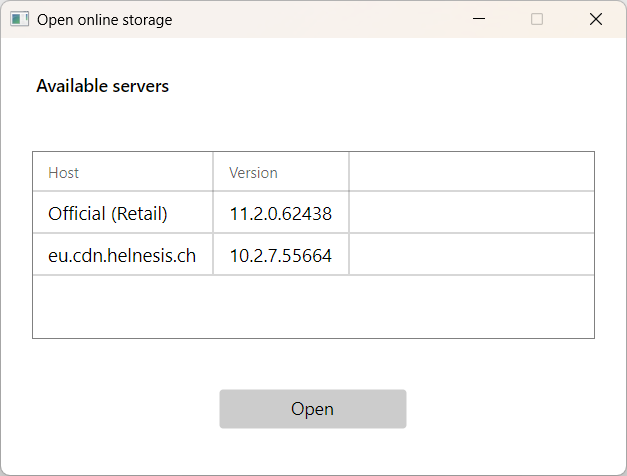
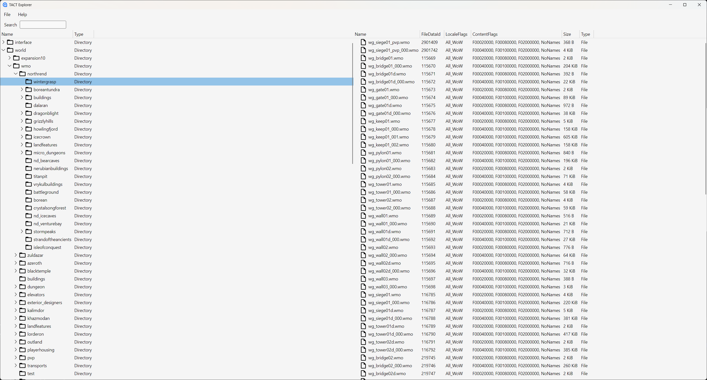

# TACT Explorer

An application to extract and visualize World of Warcraft files. **Work in progress.**

> **State:** Early alpha - APIs and UI will change. Bug reports, ideas and fixes are welcome!

--- 

## Table of contents

- [Overview](#overview)
- [Features](#features)
- [Getting started](#getting-started)
- [Acknowledgements](#acknowledgements)


## Overview
**TACTExplorer** is a cross‑platform desktop tool (C#/.NET, Avalonia UI) focused on exploring assets stored in Blizzard’s **TACT / CASC** content system as used by *World of Warcraft*. It uses the [TACTSharp](#https://github.com/wowdev/TACTSharp) library.

## Features

**Current**

- Browse World of Warcraft data and view basic metadata.
- Customizable CDN servers
- Customizable listfile provider
- Extract selected files or folders to disk.


**Planned / in progress**
- File previews for common formats (blp, text/binary inspectors)
- Integrated DB2 reader
- ... and many as needed.

## Screenshots







## Getting started

### Prerequisites

- **.NET SDK 9.0+**

### Clone

```bash
git clone https://github.com/helnesis/TACTExplorer.git
cd TACTExplorer
```

### Restore submodules

```bash
git submodule update --init --recursive
```
### Build & run

Open the solution in **Visual Studio**, **Rider**, or **VS Code**, or use the CLI:

```bash
# Restore dependencies
 dotnet restore

# Build Release
 dotnet build -c Release

# Run (adjust the project path if needed)
 dotnet run --project src/TACTSharp.GUI
```

You can change some settings through ``settings.json`` file, as shown below:

```json
{
  "Storage": {
    "Region": "eu",
    "Product": "wow",
    "Locale": "enGB",
    "Servers": [
      {
        "Host": "eu.cdn.helnesis.ch",
        "VersionsUri": "http://eu.cdn.helnesis.ch/versions",
        "CdnsUri": "http://eu.cdn.helnesis.ch/cdns"
      }
    ],
    "Cache": {
      "BuildKey": "",
      "CdnKey": ""
    }
  },
  "Listfile": {
    "Uri": "https://github.com/wowdev/wow-listfile/releases/latest/download/verified-listfile.csv",
    "CheckForUpdates": true
  }
}
```

## Acknowledgements

- Marlamin for his open‑source library ([TACTSharp](#https://github.com/wowdev/TACTSharp))

---